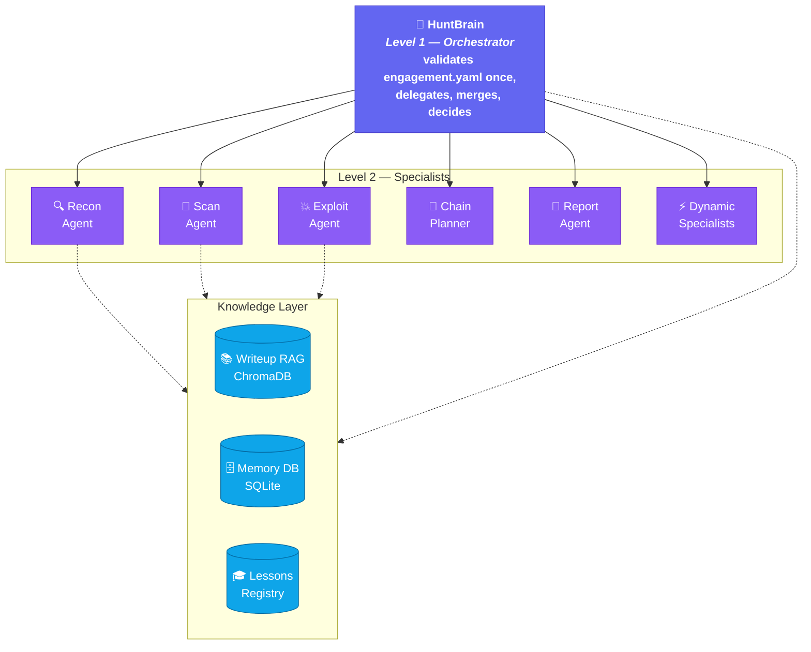
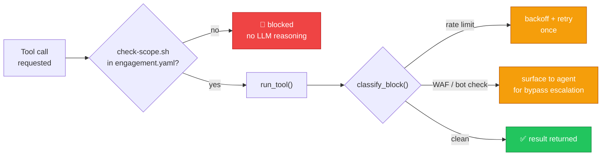
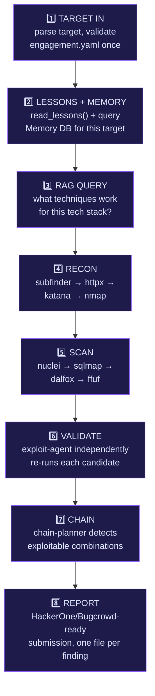

<div align="center">


[](https://github.com/ankitsingh015/HuntMCP/actions/workflows/ci.yml)
[](LICENSE)


</div>

<p align="center">
A single orchestrator (<b>HuntBrain</b>) delegates to specialist agents — Recon, Scan, Exploit,
Chain-Planner, Report, plus unlimited dynamic specialists spawned on demand — that drive real
security tools through MCP, validate their own findings before calling anything "confirmed,"
and write back what they learn after every engagement.
</p>

<div align="center">

**New to bug bounty?** Skip to [Quick Start](#quick-start) and run one command against a legal test target.
**Here for the architecture?** Jump to [Architecture](#architecture) for the full agent/data-flow diagram.

</div>

> [!IMPORTANT]
> **For authorized security testing only.** Every engagement is bound to an `engagement.yaml`
> scope file — read [Scope & Authorization](#scope--authorization) before pointing this at anything.

<br>

<div align="center">

[](#why-huntmcp)
[](#features)
[](#architecture)
[](#quick-start)
[](#usage)
[](#scope--authorization)
[](#vulnerability-coverage)

</div>

<br>

## 🎯 Why HuntMCP

Most agentic pentest tooling picks one of two extremes: a fixed scan-and-report pipeline
with no real judgment, or a single do-everything LLM loop with no guardrails. HuntMCP sits
in between, on three deliberate decisions:

<table>
<tr>
<td width="33%" valign="top">

**🔬 A validator, not a self-grader**

Scan-agent output is always a *candidate* — nothing is "confirmed" until exploit-agent
independently reproduces it. No hallucinated finding ever reaches a report.

</td>
<td width="33%" valign="top">

**🔒 Safety, structurally enforced**

Scope is validated once against `engagement.yaml`, then checked deterministically
(no LLM call, can't be reasoned away) before every single tool invocation.

</td>
<td width="33%" valign="top">

**📈 Gets better every engagement**

Confirmed findings *and* closed false positives both write back to a Lessons Registry —
the next hunt on a similar stack starts smarter than the last one did.

</td>
</tr>
</table>

---

## ✨ Features

| | |
|---|---|
| 🤖 **Multi-Level AI Orchestration** | Level 1 HuntBrain delegates to Level 2 specialists (Recon, Scan, Exploit, Chain-Planner, Report). Not a fixed pipeline — the AI decides what to run next based on what recon actually finds. |
| 🔀 **Dual Harness, Zero Lock-In** | Run the exact same agent roster two ways: [OpenCode](https://opencode.ai) (`.opencode/agents/`, any model provider) or native [Claude Code](https://claude.com/claude-code) subagents (`.claude/agents/`, `.mcp.json`). Same MCP servers, same knowledge layer, pick your harness. |
| 🌐 **No Model Lock-In** | `model_gateway.py` resolves a provider per agent role from an explicit override or an automatic fallback chain: Anthropic → OpenAI → DeepSeek → Groq → OpenRouter → local Ollama. Bring whichever API key you have. |
| 🔒 **Scope-Gated by Design** | Authorization is validated once per engagement against `engagement.yaml`, then every Tier-2 tool call runs a cheap, deterministic domain check via `scripts/check-scope.sh` before touching a host. No token spent re-verifying scope on every action; no way to silently drift out of scope either. |
| ⚡ **Reactive Rate Limiting** | No blanket per-request delay. `tool_resolver.run_tool()` only reacts when it actually detects a block: a genuine rate limit gets one backoff-and-retry, a WAF/bot-detection block is surfaced to the agent to escalate with real bypass tooling instead of just sleeping. |
| 🧠 **Three-Part Knowledge Layer** | Writeup RAG (ChromaDB + sentence-transformers, learns from public writeups *and* on-demand NVD CVE lookups), Memory DB (SQLite, per-target hunt history), and a self-improving Lessons Registry — structured technique write-back after every confirmed finding *and* every closed false positive. |
| 🔗 **Vulnerability Chaining** | `chainer-mcp` runs a DAG-based planner across 15 chain templates (IDOR+XSS→ATO, SSRF+cloud→credential access, upload+LFI→RCE…) and escalates severity when a chain lands. |
| 🎭 **Authenticated Session Testing** | `browser-mcp` seeds a real headless Chromium with cookies, Bearer tokens, or `localStorage` — test an SPA as a logged-in user, or diff the same page across two roles for an IDOR check. |
| 🔁 **Automated IDOR/BOLA Sweeps** | `idor-mcp` takes a URL template, a list of object IDs, and two identities' credentials, then classifies every pair (protected / leaked / ambiguous) in one pass instead of hand-crafting each curl comparison. |
| 📚 **Curated Payload Library** | 11 hand-reviewed payload sets (`knowledge/payloads/`) and matching wordlists for when nuclei/sqlmap/dalfox's automated pass comes back clean and a human-style bypass is needed. |
| 📝 **Auto-Reporting** | One file per finding (`NN-<severity>-<slug>.md` + a `README.md` index) — never one long combined report a reviewer has to scroll through. PoC, CVSS v3.1 vector, business impact, remediation. |
| 📡 **Continuous Monitoring** | `watch-mcp` diffs subdomains/endpoints over time and flags what's new. |
| 🌍 **Hosted Backend (optional)** | A Go + Postgres/pgvector backend (`backend/`) for teams that want the writeup RAG and hunt memory served centrally instead of local ChromaDB/SQLite. |

---

## 🏗️ Architecture



*Dynamic specialists (GraphQL, JWT, OAuth, Cloud…) spawn on demand when HuntBrain detects
relevant technology — plain markdown files with locked-down tool access, not persistent
processes. Both harnesses (OpenCode and Claude Code) drive the same MCP servers and knowledge
layer underneath; only the orchestration layer on top differs.*

Every Tier-2 tool call (anything that touches the live target) runs through the same
deterministic gate, regardless of which specialist calls it:



See [ARCHITECTURE.md](ARCHITECTURE.md) for the full design, WSTG methodology mapping, and
phase-by-phase build status.

---

## 🚀 Quick Start

<details open>
<summary><b>1. Prerequisites</b></summary>

- Python 3.10+ (3.12 used in CI)
- Go tools: `subfinder`, `httpx`, `nuclei`, `katana`, `ffuf`, `dalfox`, plus `nmap`
- At least one model provider API key (Anthropic, OpenAI, DeepSeek, Groq, OpenRouter) — or a local Ollama install
- [OpenCode](https://opencode.ai) v1.17+ **or** [Claude Code](https://claude.com/claude-code) — pick one harness, or install both

</details>

<details open>
<summary><b>2. Install</b></summary>

```bash
git clone https://github.com/ankitsingh015/HuntMCP.git
cd HuntMCP

# Python deps — install per MCP server you plan to use, e.g.:
python3 -m venv .venv && source .venv/bin/activate
for req in mcp-servers/*/requirements.txt; do pip install -r "$req"; done

# Security tools (Go)
go install github.com/projectdiscovery/subfinder/v2/cmd/subfinder@latest
go install github.com/projectdiscovery/httpx/cmd/httpx@latest
go install github.com/projectdiscovery/nuclei/v3/cmd/nuclei@latest
go install github.com/projectdiscovery/katana/cmd/katana@latest
go install github.com/ffuf/ffuf/v2@latest
go install github.com/hahwul/dalfox/v2@latest
go install github.com/projectdiscovery/interactsh/cmd/interactsh-client@latest
# nmap via your OS package manager (apt/brew/...)

# Initialize local databases
./scripts/setup-db.sh
```

</details>

<details open>
<summary><b>3. Pick a model provider</b></summary>

```bash
export ANTHROPIC_API_KEY=sk-...   # or OPENAI_API_KEY / DEEPSEEK_API_KEY / etc.
./scripts/select-model.sh
```

</details>

<details open>
<summary><b>4. Define your engagement — required before any agent touches a target</b></summary>

```bash
cp engagement.yaml.example engagement.yaml
$EDITOR engagement.yaml   # set target, in_scope, program_url, authorized_on
```

</details>

<details open>
<summary><b>5. Run it</b></summary>

```bash
# Verify setup (OpenCode)
opencode run "HuntMCP audit testphp.vulnweb.com --quick"

# ...or verify with Claude Code
claude
> /audit testphp.vulnweb.com
```

</details>

---

## 💻 Usage

### OpenCode
```bash
opencode run "HuntMCP audit example.com"                # full autonomous audit
opencode run "HuntMCP audit example.com --quick"         # recon + nuclei only
opencode run "HuntMCP watch example.com --interval 6h"   # continuous monitoring
opencode run "HuntMCP report <scan-id>"
opencode run "HuntMCP chain <scan-id>"                   # vulnerability chaining analysis
opencode run "HuntMCP ingest <url> --class XSS --tech React"
opencode run "HuntMCP learn --query 'XSS in React apps'"
```

**Running multiple targets at once?** `source scripts/new-target-session.sh <target>` in each
terminal before launching `opencode` gives that session its own isolated active-engagement
pointer — no target's state or narration bleeds into another's. `scripts/switch-engagement.sh
sessions` lists a ready-to-copy command for every target you've already started.

### Claude Code
```bash
claude
> /audit example.com        # requires engagement.yaml to already match the target
```
HuntBrain and every Level 2 specialist are registered as native subagents
(`.claude/agents/*.md`) with locked-down tool allowlists — Claude Code will spawn them
automatically as the engagement progresses.

---

## 🔒 Scope & Authorization

> [!WARNING]
> Nothing runs against a target without `engagement.yaml` (gitignored — this file names a real
> target and stays local).

HuntBrain validates it **once** at the start of an engagement; every subsequent Tier-2 action
(recon/scan/exploit) then runs the cheap, deterministic `scripts/check-scope.sh <host>` before
touching that host — no LLM call, no per-action re-validation, no way to silently wander out of
scope either. See `engagement.yaml.example` for the format.

**Multiple targets, one machine:** `scripts/switch-engagement.sh set <target>` puts
`engagement.yaml` (and `budget.json`/`work-registry.json`/`findings-seen.json`) under
`data/engagements/<slug>/` instead of the repo root — HuntBrain runs this automatically at
Phase 0. Pausing one target to start another is just `set <other-target>`; the paused target's
state sits untouched until you `set` back to it. For genuinely **concurrent** sessions across
separate terminals, see `scripts/new-target-session.sh` above — it isolates the active-pointer
itself, not just the on-disk state. `scripts/switch-engagement.sh list` shows every target with
state on disk.

---

## ⚙️ How It Works

### The HuntBrain Decision Loop



Rate limiting and blocking are handled reactively inside `tool_resolver.run_tool()`, not as a
separate loop step — a detected rate limit gets one backoff-and-retry; a WAF/bot-detection
block is surfaced to the agent instead of just waiting it out.

### Learning from Writeups (RAG)

No model fine-tuning. Retrieval-Augmented Generation instead:

| Method | Frequency | Source |
|--------|-----------|--------|
| Manual | On-demand | `scripts/ingest-writeup.sh --url ...` or `/ingest` command |
| Cron | Configurable | `scripts/cron-fetch.sh` — HackerOne Hacktivity, GitHub writeup repos, blogs |
| CVE lookup | On-demand, per fingerprinted product | `scripts/fetch-cves.sh <keyword>` or `writeup-mcp`'s `fetch_cves(keyword)` tool — pulls from NVD, auto-embeds, idempotent |

Each writeup is chunked, embedded via `sentence-transformers`, and stored in ChromaDB. Agents
query this before testing any vulnerability class, retrieving proven techniques from similar
targets — plus whatever the Lessons Registry has learned from *this* project's own past
engagements.

### Multi-Level Agent System

| Level | Agent | Responsibility | Key MCP Tools |
|:-:|---|---|---|
| 1 | 🧠 **HuntBrain** | Orchestrator — delegates, merges, decides | `memory-mcp`, `writeup-mcp`, `lessons-mcp` |
| 2 | 🔍 **Recon Agent** | Asset discovery | `subfinder-mcp`, `httpx-mcp`, `katana-mcp`, `nmap-mcp` |
| 2 | 🎯 **Scan Agent** | Vulnerability detection | `nuclei-mcp`, `sqlmap-mcp`, `dalfox-mcp`, `ffuf-mcp` |
| 2 | 💥 **Exploit Agent** | Validation + chaining | `chainer-mcp`, `browser-mcp`, `idor-mcp`, `oob-mcp` |
| 2 | 🔗 **Chain Planner** | DAG-based chain analysis | `chainer-mcp`, `memory-mcp`, `writeup-mcp` |
| 2 | 📝 **Report Agent** | Report generation | `writeup-mcp` |
| 2 | ⚡ **Dynamic specialists** | GraphQL, JWT, OAuth, Cloud, etc. | Spawned on demand, scoped per-task |

Burp Suite integration (Repeater/Collaborator validation) is an optional enhancement tier in
[ARCHITECTURE.md](ARCHITECTURE.md), not a hard requirement — the built agents above run
entirely on the open-source tool chain. Out-of-band confirmation (blind SSRF/XXE/SQLi/RCE) is
already covered without Burp via `oob-mcp` (wraps `interactsh-client`).

If you do have Burp Suite, wiring it up as a *live* MCP integration (real proxy history,
Repeater, Collaborator, Scanner issues — 27 tools total) takes one command:

```bash
# In Burp: Extensions tab > BApp Store > install "MCP Server" > start it.
./scripts/connect-burp.sh          # registers the bridge, then restart your session
./scripts/connect-burp.sh --remove # undo
```

This is a personal `--scope local` MCP registration (your own `~/.claude.json`), not
something the repo forces on every clone — it only works while Burp is open on your
machine with the extension running. This is separate from `burp-import-mcp` (always
available, no Burp needed — reads a manually-exported HTTP-history XML file).

---

## 🌐 Model Providers

Set an explicit override (a provider name, not a model string — the gateway picks each
provider's default model), or let the fallback chain pick automatically:

```bash
# Global override — every agent role uses this
export HUNTMCP_MODEL=deepseek

# Per-role override — only the exploit agent uses this
export HUNTMCP_MODEL_EXPLOIT=anthropic

# Local/self-hosted model via Ollama — including a fine-tuned one
export HUNTMCP_MODEL=ollama
export HUNTMCP_LOCAL_MODEL=my-qlora-finetune   # defaults to whiterabbitneo if unset

# No override set → model_gateway.py walks the chain:
# Anthropic → OpenAI → DeepSeek → Groq → OpenRouter → local Ollama
./scripts/select-model.sh
```

Claude Code subagents pin their own model in each `.claude/agents/*.md` file's frontmatter
(`model: sonnet` / `opus` / `inherit`) since that harness always runs on Claude — the gateway
above applies to the OpenCode harness, where every provider is fair game.

---

## 🛡️ Vulnerability Coverage

HuntMCP tests 30+ vulnerability classes across the OWASP Web Security Testing Guide (WSTG)
methodology, backed by 52 technique skills covering everything from low-hanging fruit to
deep-cut, disclosed-report-derived edge cases:

| Category | Classes | Primary Tooling |
|---|---|---|
| 💉 **Injection** | SQLi, XSS, SSTI, Command Injection, LDAP, XPath, XXE | `sqlmap`, `dalfox`, `nuclei` |
| 🔑 **Authentication** | Auth Bypass, JWT Attacks, OAuth Abuse, SAML, OTP Bypass, Session Fixation, Password Reset Poisoning | nuclei templates, curated payload library |
| 🚪 **Authorization** | IDOR, Mass Assignment, Privilege Escalation, API Auth Bypass, CORS, GraphQL Bypass | `idor-mcp`, `ffuf`, curated payload library |
| ⚖️ **Business Logic** | Race Conditions, Negative Values, Workflow Bypass, Coupon Abuse | manual verification, exploit-agent |
| 🖥️ **Server-Side** | SSRF, LFI/RFI, File Upload, Deserialization, Prototype Pollution, HTTP Smuggling, Cache Poisoning | `nuclei`, curated payload library |
| ☁️ **Infrastructure** | Subdomain Takeover, S3/Cloud Buckets, Security Headers, CVE Scan, WAF Bypass, TLS/SSL | `nuclei`, `subfinder`, `nmap` |
| 🔗 **Chained** | Any combination the chain-planner's 15 DAG templates recognize | `chainer-mcp` |

---

## 📁 Project Structure

<details>
<summary><b>Click to expand full directory layout</b></summary>

```
HuntMCP/
├── mcp-servers/               24 FastMCP servers (one per tool) + shared libs:
│   ├── tool_resolver.py         binary resolution + reactive rate-limit/WAF handling
│   ├── scope_guard.py           engagement.yaml scope checks (shared across harnesses)
│   ├── budget_guard.py          Tier-2 tool-call budget circuit-breaker
│   ├── engagement_paths.py      per-target state dirs -- multi-target hunting, no state mixing
│   ├── model_gateway.py         multi-provider model selection
│   ├── audit_log.py             per-call JSON audit trail
│   ├── dedupe_check.py          duplicate-finding check
│   ├── case_store.py            persistent case state -- hypotheses, evidence, finding lifecycle
│   ├── bounty_scope.py          aggregated bounty-program scope cache/lookup/diff
│   ├── disclosed_reports.py     disclosed-vulnerability-report cache/search
│   ├── content_scanner.py       OWASP Skill/MCP Top 10-style safety scan for new content
│   ├── browser-mcp/             headless-Chromium JS/DOM confirmation + auth session seeding
│   ├── idor-mcp/                automated cross-account IDOR/BOLA sweep
│   ├── secrets-mcp/             gitleaks secret scan + JS-bundle endpoint inventory
│   └── oob-mcp/                 interactsh-client wrapper (blind SSRF/XXE/SQLi/RCE)
├── .opencode/
│   ├── agents/                 Multi-level agent files (OpenCode harness)
│   ├── plugin/scope-gate.ts     tool.execute.before hook -- structural scope enforcement
│   └── commands/                /ingest, /learn, /chain, /watch
├── .claude/
│   ├── agents/                 Same agent roster, native Claude Code subagents
│   ├── commands/                /audit
│   └── settings.json            PreToolUse hook: structural scope + rm enforcement
├── .mcp.json                   MCP server registration for Claude Code
├── scripts/
│   ├── hooks/scope_gate_hook.py     shared scope/rm-block hook, both harnesses
│   ├── new-target-session.sh        isolate a session for true concurrent multi-target hunting
│   └── check-scope.sh, check-budget.sh, switch-engagement.sh, setup, ingestion, cron
├── knowledge/
│   ├── master-pentest-prompt.md  Phase-mapped WSTG methodology reference
│   ├── payloads/                 Curated payload lists per vulnerability class
│   └── wordlists/                Directories, API endpoints, subdomains
├── data/
│   ├── chroma/                  Vector DB (local, gitignored)
│   ├── engagements/<slug>/       Per-target state -- scope, budget, findings, reports
│   └── writeups/                 Raw writeup markdown (git-tracked)
├── backend/                     Optional Go + Postgres/pgvector hosted backend
├── engagement.yaml.example      Scope file format (real engagement.yaml is gitignored)
├── opencode.jsonc                MCP configuration + permissions (OpenCode)
├── docker-compose.yml / Dockerfile
├── CLAUDE.md / AGENTS.md         Coding-agent guidance for this repo
└── ARCHITECTURE.md               Full system design + phase-by-phase build status
```

</details>

---

<div align="center">

## 📄 License

[MIT](LICENSE) — use freely, adapt for your project, no attribution required.

<br>

*Built on MCP · Runs on OpenCode or Claude Code · For authorized security testing only*


</div>
